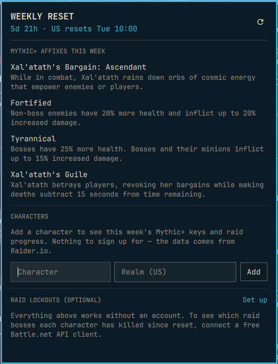

# WoW Weekly Reset for Omarchy

A small Omarchy bar widget for World of Warcraft players: a countdown to the weekly reset, this week's
Mythic+ affixes, and where each of your characters stands for the week.

No account and no API key needed for the basics. Raid lockouts are an optional extra.



## What it does

- **Bar chip** — time until the weekly reset, e.g. `2d 3h`. US resets Tuesday 15:00 UTC, EU Wednesday
  04:00 UTC, KR/TW Wednesday 23:00 UTC. The chip turns your accent colour in the last six hours.
- **Bar icon** — a sword by default. Pick *Horde* or *Alliance* under *Bar icon* in the widget settings and
  the faction emblem replaces it, drawn in the bar colour.
- **Click the chip** — this week's affixes, then a card per character:
  - Mythic+ runs this week, highest keys, and Great Vault dungeon slots (1 / 4 / 8 runs).
  - Season raid progression (from Raider.io), or — with Battle.net connected — which bosses they have
    killed **since reset** on each difficulty, and Great Vault raid slots.
- **Middle-click the chip** — refresh without opening the panel.

Data refreshes when the shell starts, every hour, a few minutes after reset, and on demand.

## Setup tiers

1. **Nothing.** Install it: the countdown and affixes just work.
2. **Add characters** — type a name and realm in the panel. Looked up on Raider.io, no sign-in.
3. **Raid lockouts (optional)** — World of Warcraft has no public "saved instances" API, but Blizzard's
   armory records each boss's last kill time. Connecting a free API client lets the widget count kills since
   reset:
   1. Sign in at [develop.battle.net](https://develop.battle.net) → *API Access* → *Create Client*
      (any name; the redirect URL can be `http://localhost`; it is never used).
   2. In the panel, *Raid lockouts → Set up*, paste the Client ID and Client Secret, *Connect*.

   This uses client credentials (public character data), so there is no Battle.net login and nothing
   expires every 24 hours. Armory data updates after a character logs out, and characters with a private
   profile show no lockouts.

## Faction emblems

The Horde and Alliance emblems are Blizzard artwork, so they are not in this repository. The first time you pick
one, the helper downloads a 128px thumbnail from [warcraft.wiki.gg](https://warcraft.wiki.gg), keeps only its
shape (the Horde sigil's outline; the gold of the Alliance lion) as a white mask, and caches it as
`~/.local/state/omarchy-wow-reset/emblem-<faction>.png`. The sword is shown until that finishes, and stays if
the download fails.

## Requirements

- Omarchy (Quickshell bar), 4.0.3 or later.
- Python 3 (stdlib only).
- Network access to `https://raider.io`; for a faction icon `https://warcraft.wiki.gg`; for lockouts
  `https://oauth.battle.net` and `https://<region>.api.blizzard.com`.

## Install

```sh
omarchy plugin add https://github.com/ninepointlabs/omarchy-wow-reset.git --enable
```

### From a local checkout

```sh
~/Projects/omarchy-wow-reset/install.sh
omarchy plugin enable ninepointlabs.wow-reset
omarchy restart shell
```

Pick the region in the widget settings (default US).

## Remove

```sh
omarchy plugin remove ninepointlabs.wow-reset
```

Your characters and any Battle.net credentials stay in `~/.local/state/omarchy-wow-reset/`; delete that
directory to remove them.

## Limits

- Twelve characters.
- Great Vault counts are an estimate from public data: dungeon slots from Raider.io's weekly runs, raid slots
  from distinct bosses killed this week on any difficulty. The in-game vault is authoritative.
- Raider.io's weekly list updates when it crawls a character, so a key you just finished may take a while
  to show up.

## Security notes

- **Nothing runs through your `PATH`.** The widget starts exactly one program: Python 3 from a fixed
  absolute path (`/usr/bin/python3`, then `/bin/python3`, then `/run/current-system/sw/bin/python3`),
  with the session environment replaced by `PATH=/usr/bin:/bin:/run/current-system/sw/bin` and
  `LC_ALL=C.UTF-8`, and `-I -S -B`. No shell.
- **Bounded jobs.** Every job runs under `bin/bounded-run`: output caps enforced as bytes arrive, a deadline,
  and TERM→KILL of the job's process group.
- **Allow-listed hosts.** `bin/wow-reset-ops` only talks HTTPS to `raider.io`, `warcraft.wiki.gg`,
  `oauth.battle.net` and `{us,eu,kr,tw}.api.blizzard.com`; redirects to another host are refused, environment proxies are ignored,
  and response bodies are capped while read.
- **Credentials stay in the helper.** The Client ID and Secret go to the helper over stdin (never argv),
  are checked against Battle.net before they are saved, and live in `blizzard.json` (0600). The shell
  only learns whether credentials are set; they are never sent back, logged, or written to `shell.json`.
  The secret field is masked and cleared when the panel closes.
- **Descriptor-based store.** `~/.local/state/omarchy-wow-reset` is opened one component at a time with
  `O_NOFOLLOW` and ownership/permission checks (kept at 0700); files are read with `O_NOFOLLOW|O_NONBLOCK`,
  must be regular, singly-linked and yours, and are replaced atomically from a 0600 temp file.
- **Emblem images are re-encoded, not trusted.** The download is capped at 256 KiB; the helper's own stdlib
  decoder accepts only 8-bit RGBA PNGs up to 512×512 with valid chunk CRCs, inflates no further than the
  declared size, and writes a fresh mask PNG. The shell only loads a path ending in
  `/.local/state/omarchy-wow-reset/emblem-horde.png` or `…/emblem-alliance.png`.
- Names, realms, affixes and boss names are stripped of tags and rendered as `Text.PlainText`.

## Tests

```sh
node tests/model.test.cjs                      # reset math, lockout/vault counting, process boundary
/usr/bin/python3 -I -B tests/ops_test.py       # parsers on saved API responses; settings store
tests/bounded-run.test.sh bin/bounded-run      # supervisor: caps, deadline, process-group cleanup
```
